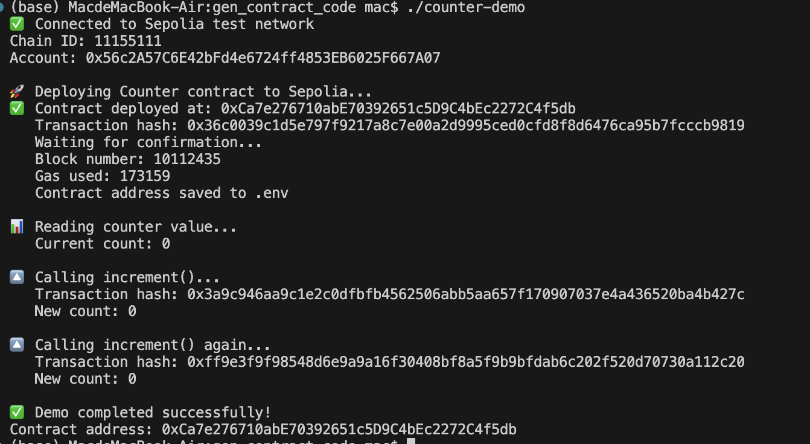

# Counter DApp

使用 Go 与 Solidity 开发的区块链计数器合约，部署在 Sepolia 测试网络。

## 功能

- 部署 Counter 智能合约到 Sepolia 测试网络
- 读取当前计数器值
- 调用 `increment()` 增加计数

## 项目结构

```
gen_contract_code/
├── Counter.sol          # Solidity 智能合约
├── Counter.abi          # 合约 ABI (编译生成)
├── Counter.bin          # 合约字节码 (编译生成)
├── counter/
│   └── Counter.go       # abigen 生成的 Go 绑定
├── main.go              # 主程序 (连接合约、调用方法)
├── .env                 # 环境变量 (私钥、RPC、合约地址)
├── .env.example         # 环境变量模板
├── .gitignore           # Git 忽略配置
├── go.mod / go.sum      # Go 依赖
└── counter-demo         # 编译后的可执行文件
```

## 环境配置

1. 复制模板文件：
```bash
cp .env.example .env
```

2. 编辑 `.env`，填入你的配置：
```env
RPC_URL=https://sepolia.infura.io/v3/YOUR_INFURA_KEY
PRIVATE_KEY=你的私钥(不带0x前缀)
CONTRACT_ADDRESS=  # 首次部署留空，程序会自动填写
```

3. 获取 Sepolia 测试币：
   - [Sepolia Faucet](https://sepoliafaucet.com/)

## 编译运行

```bash
# 构建
go build -o counter-demo main.go

# 运行 (首次会部署合约，后续使用已有合约)
./counter-demo
```

## 智能合约

```solidity
pragma solidity >=0.6.0 <0.7.0;

contract Counter {
    uint256 private count = 0;

    function getCount() public view returns (uint256)
    function increment() public
    function decrement() public
    function reset() public
}
```

## 技术栈

- **Solidity** - 智能合约开发
- **solc-js** - Solidity 编译器
- **abigen** - 生成 Go 绑定代码
- **go-ethereum** - Go Ethereum 客户端库
- **Sepolia** - Ethereum 测试网络

## License

MIT

## 结果
