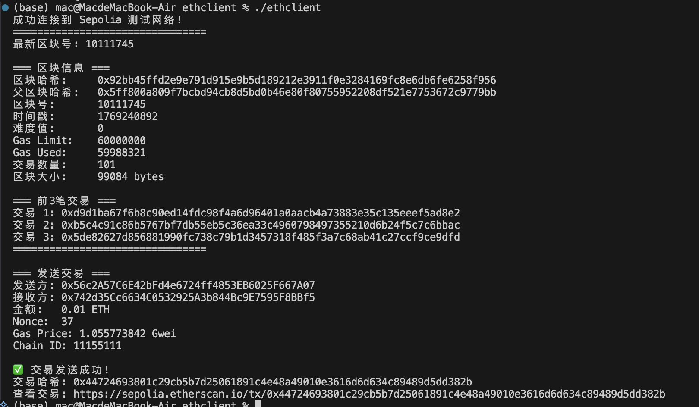

# Ethereum Sepolia 测试网络交互示例

使用 Go 和 go-ethereum 库连接 Sepolia 测试网络，实现区块查询和发送交易功能。

## 前置条件

- Go 1.18+
- go-ethereum 库

## 安装依赖

```bash
go mod tidy
go build -o ethclient .
```

## 配置

### 设置私钥

私钥通过环境变量 `PRIVATE_KEY` 获取：

```bash
# 临时设置
export PRIVATE_KEY='0x你的私钥'

# 或临时运行
PRIVATE_KEY='0x你的私钥' ./ethclient
```

**注意**：私钥从 MetaMask 导出（设置 -> 账户详情 -> 导出私钥）

## 运行

```bash
./ethclient
```

## 功能

### 1. 区块查询
- 查询最新区块号
- 获取区块哈希、时间戳、交易数量
- 列出前3笔交易

### 2. 发送交易
- 从配置账户转账 0.01 Sepolia ETH
- 自动获取 nonce 和 gas price
- 签名并发送交易
- 输出交易哈希和 Etherscan 链接

## RPC 配置

默认使用 Infura Sepolia 端点：
```
https://sepolia.infura.io/v3/你的key
```

如需修改，编辑 [main.go](main.go#L18) 中的 `rpcURL` 变量。

## 获取测试币

从 Sepolia 水龙头获取测试 ETH：
- https://sepoliafaucet.com/
- https://faucet.sepolia.org/

## 结果
