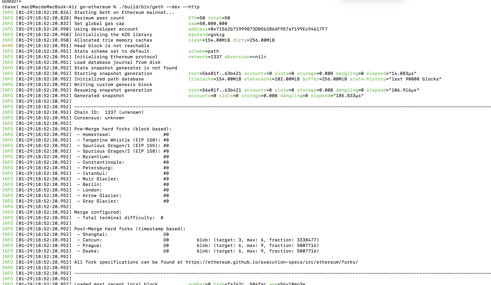
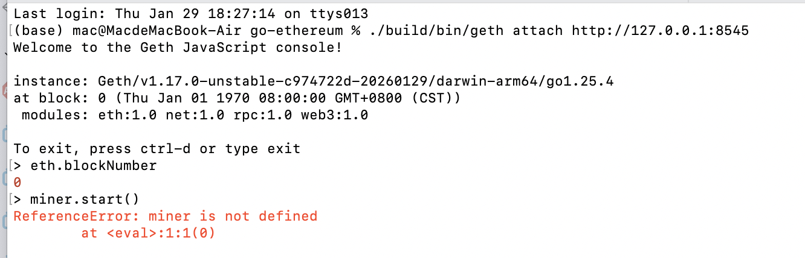

# 09 - 实践验证指南

> 返回: [[Go-Ethereum 核心功能与架构设计研究作业]] | 上一章: [[08-共识算法]]

## 9.1 环境准备

### 系统要求

```
系统要求:
├── 操作系统: Linux, macOS, Windows
├── Go 版本: 1.21+
├── 内存: 建议 16GB+
├── 磁盘: SSD 建议 500GB+
├── CPU: 多核 (编译和运行)
└── 网络: 稳定互联网连接
```

### 安装 Go

```bash
# macOS (使用 Homebrew)
brew install go

# Linux (Ubuntu/Debian)
sudo apt update
sudo apt install golang-go

# 验证安装
go version
# 应该显示 go1.21.x 或更高版本
```

## 9.2 获取源码

```bash
# 克隆仓库
git clone https://github.com/ethereum/go-ethereum.git

# 进入目录
cd go-ethereum

# 查看版本
git tag | head -20
```

## 9.3 编译 Geth

### 方式一: 使用 Makefile

```bash
# 完整编译
make geth

# 编译时间约 5-15 分钟
# 完成后在 build/bin/geth
```

### 方式二: 手动编译

```bash
# 设置 Go 模块
export GO111MODULE=on

# 构建可执行文件
go build -o build/bin/geth ./cmd/geth

# 或者使用 install
go install ./cmd/geth
```

### 验证编译

```bash
# 检查版本
./build/bin/geth version

# 输出示例:
# Geth
# Version: 1.13.x
# Git Commit: abc123...
# Architecture: amd64
# Go Version: go1.21.x
# Operating System: darwin
```

## 9.4 运行开发网络

### 启动开发网络

```bash
# 启动开发网络 (带 HTTP RPC)
./build/bin/geth --dev --http --http.api=eth,web3,net,debug

# 或者使用默认端口
./build/bin/geth --dev --http
```

### 启动参数说明

```bash
# 常用参数:
--dev              # 开发模式 (自动挖矿，快速出块)
--http             # 启用 HTTP RPC
--http.port=8545   # HTTP 端口
--http.api=eth,web3,net,debug  # 启用的 API
--ws               # 启用 WebSocket
--datadir          # 数据目录
--verbosity        # 日志级别 (1-6)
```

### 预期输出

```
INFO [01-29|10:00:00] Starting Geth on dev mode
INFO [01-29|10:00:00] Set options for mode a dev, implicit the following
INFO [01-29|10:00:00] Maximum peer count                       eth=50 total=50
INFO [01-29|10:00:00] Starting networking service
INFO [01-29|10:00:00] RLPx listener up                         self=enode://...
INFO [01-29|10:00:00] HTTP server started                      url=http://127.0.0.1:8545
INFO [01-29|10:00:00] Transaction pool price configuration ...
INFO [01-29|10:00:00] Starting mining operation
INFO [01-29|10:00:00] Commit new mining work                   number=1 ...
```

## 9.5 控制台验证

### 启动控制台

```bash
# 新终端中启动控制台
./build/bin/geth attach http://127.0.0.1:8545

# 或者使用 IPC
./build/bin/geth attach ~/.ethereum/geth.ipc
```

### 常用命令

```javascript
// 查看区块高度
> eth.blockNumber
// 输出: 0, 1, 2, ...

// 查看账户余额
> eth.getBalance(eth.accounts[0])
// 输出: BigInt(余额，单位: Wei)

// 查看账户列表
> eth.accounts
// 输出: ["0x..."]

// 创建新账户
> personal.newAccount("password")
// 输出: "0x..."

// 查看同步状态
> eth.syncing
// 输出: false (开发网络) 或同步对象

// 查看当前网络 ID
> net.version
// 输出: "1" (主网), "5" (Goerli), "1337" (本地)

// 查看节点信息
> admin.nodeInfo
```

### 挖矿控制

```javascript
// 启动挖矿 (开发网络已自动启动)
> miner.start()

// 停止挖矿
> miner.stop()

// 查看挖矿状态
> eth.mining
// 输出: true 或 false

// 设置挖矿线程数
> miner.setEtherbase(eth.accounts[0])

// 挖一个区块
> miner.start(1); admin.sleepBlocks(1); miner.stop()
```

### 发送交易

```javascript
// 解锁账户
> personal.unlockAccount(eth.accounts[0], "password", 300)

// 发送 ETH
> eth.sendTransaction({
    from: eth.accounts[0],
    to: eth.accounts[1],
    value: web3.toWei(1, "ether")
})

// 查看交易池
> txpool.status
// 输出: { pending: n, queued: m }
```

### 部署合约

```javascript
// 编译合约 (使用 Solidity)
> source = "pragma solidity ^0.8.0; contract Test { uint a; function set(uint x) public { a = x; } function get() public view returns (uint) { return a; } }"

// 编译
> contract = eth.compileSolidity(source)[source]

// 部署
> tx = { from: eth.accounts[0], data: contract.code, gas: 3000000 }
> eth.sendTransaction(tx)

// 获取合约地址
> txhash = eth.sendTransaction({ from: eth.accounts[0], data: contract.code, gas: 3000000 })
> eth.getTransactionReceipt(txhash).contractAddress

// 调用合约
> test = eth.contract(contract.abi).at("0x...")
> test.set(42)
> test.get()
```

## 9.6 调试和日志

### 日志级别

```bash
# 1: ERROR
# 2: WARN
# 3: INFO (默认)
# 4: DEBUG
# 5: DETAIL
# 6: TRACE

# 启动时设置
./build/bin/geth --verbosity 4 --dev --http
```

### 实时日志查看

```bash
# 查看实时日志 (Linux/macOS)
tail -f ~/.ethereum/geth.log

# 过滤特定模块日志
grep -i "sync" ~/.ethereum/geth.log
grep -i "p2p" ~/.ethereum/geth.log
grep -i "miner" ~/.ethereum/geth.log
```

## 9.7 常见问题

### 问题 1: 编译失败

```bash
# 错误: go.mod not found
# 解决: 确保在 go-ethereum 目录下

# 错误: 内存不足
# 解决: 增加 swap 或减少并行编译
make geth -j 2
```

### 问题 2: 连接失败

```bash
# 错误: connection refused
# 解决: 确保 Geth 正在运行，端口正确

# 检查端口
netstat -an | grep 8545

# 检查进程
ps aux | grep geth
```

### 问题 3: 账户无法解锁

```bash
# 解锁超时
personal.unlockAccount(eth.accounts[0], "password", 3600)
// 3600 秒超时

# 使用keystore
# 确保 datadir 正确
./build/bin/geth --datadir /path/to/data --dev
```

### 问题 4: 同步缓慢

```bash
# 使用快速同步
./build/bin/geth --syncmode=fast --http

# 检查对等节点
admin.peers.length

# 添加更多 bootnodes
./build/bin/geth --bootnodes enode://... --http
```

## 9.8 进阶实验

### 实验 1: 查看区块链数据

```javascript
// 查看创世区块
> eth.getBlock(0)

// 查看最新区块
> eth.getBlock("latest")

// 查看特定区块
> eth.getBlock(100)

// 查看区块中的交易
> eth.getBlock(100).transactions

// 查看交易详情
> eth.getTransactionReceipt("0x...")
```

### 实验 2: 分析状态

```javascript
// 获取账户状态
> eth.getAccountData(eth.accounts[0])
// 输出: { nonce, balance, codeHash, storageRoot }

// 查看合约存储
> storage = eth.getStorageAt(contractAddress, 0)

// 查看合约代码
> code = eth.getCode(contractAddress)
```

### 实验 3: 压力测试

```javascript
// 批量发送交易
> for (i = 0; i < 10; i++) { eth.sendTransaction({from: eth.accounts[0], to: eth.accounts[1], value: 1}); }
```

## 9.9 资源清理

### 停止 Geth

```javascript
// 在控制台中
> exit

// 或者使用 Ctrl+C (如果在前台运行)
```

### 清除数据

```bash
# 清除开发网络数据
rm -rf ~/.ethereum/geth

# 清除所有数据
rm -rf ~/.ethereum
```

---

## 作业检查清单

- [ ] 环境准备完成 (Go 安装)
- [ ] 源码克隆完成
- [ ] 编译成功 (`make geth`)
- [ ] 启动开发网络
- [ ] 连接控制台
- [ ] 执行验证命令:
  - [ ] `eth.blockNumber`
  - [ ] `eth.accounts`
  - [ ] `eth.getBalance`
  - [ ] `miner.start()`
  - [ ] 发送交易
- [ ] 理解输出日志
- [ ] 清理测试数据

---

**返回**: [[Go-Ethereum 核心功能与架构设计研究作业]]


## 运行示例

启用服务


这里不让挖矿，应该是我的eth版本已经完全切到pos了，不让挖矿